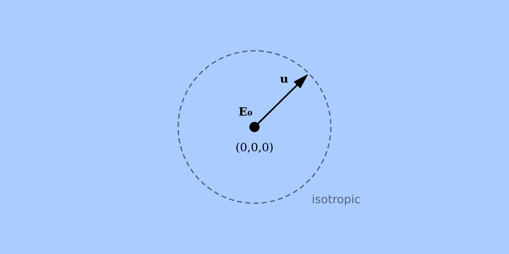

# 20251015: Energy conservation in infinite media <!-- omit in toc -->

## Table of contents <!-- omit in toc -->

- [1. Overview](#1-overview)
  - [1.1. Purpose](#11-purpose)
  - [1.2. Scope](#12-scope)
  - [1.3. Rationale](#13-rationale)
  - [1.4. Expectation](#14-expectation)
- [2. Specification](#2-specification)
  - [2.1. Particles](#21-particles)
  - [2.2. Materials](#22-materials)
  - [2.3. Energies](#23-energies)
  - [2.4. Geometry](#24-geometry)
  - [2.5. Source](#25-source)
  - [2.6. Physics](#26-physics)
  - [2.7. Measurand](#27-measurand)
  - [2.8. Method](#28-method)
  - [2.9. Report](#29-report)
    - [2.9.1. Input](#291-input)
    - [2.9.2. Results](#292-results)

## 1. Overview

### 1.1. Purpose

Verify that Monte Carlo simulation correctly conserve energy during particle transport.

### 1.2. Scope

Verify energy conservation for monoenergetic electrons and photons (1 keV to 20 MeV) in infinite homogeneous media. Test matrix includes 13 materials: 12 representative elements spanning, plus air and liquid water. Each software simulates 72 cases (2 particles × 9 materials × 4 energies) with the expected result that total deposited energy equals initial particle energy within floating-point precision. This benchmark tests internal algorithm consistency and floating point precision, rather than agreement with experimental data.

### 1.3. Rationale

Energy conservation is a fundamental principle and requirement for a software modelling the transport of ionizing radiation. In numerical simulation on a finite-precision computer, however, floating-point errors (on the order of $10^{-16}$ in 64-bit IEEE 754 representation) accumulate in the Monte Carlo algorithm. This scenario is meant to verify that floating point errors are under control in the simulation software, for a set of representative energies and materials.

### 1.4. Expectation

The total energy deposited per incident particle is equal to the initial particle energy, within a range that can be explained by floating-point arithmetic error propagation.

## 2. Specification

### 2.1. Particles

- Monoenergetic electrons
- Monoenergetic photons

### 2.2. Materials

- **Elements:** 1 (H), 6 (C), 13 (Al), 27 (Co), 47 (Ag), 74 (W), 82 (Pb)
- **Compounds:** Air, Water
- **State:** Natural state at room temperature (gas, liquid, solid)

### 2.3. Energies

- **Kinetic energies:** 10 keV, 100 keV, 1 MeV, 10 MeV

### 2.4. Geometry

- Infinite homogeneous medium (no boundaries).

- Particle starts at origin with kinetic energy $E_0$.

- Diagram:

  

- If the software cannot model an infinite medium space, the implementation should:

  - Use a sphere of radius 40 × mean free paths of photons with the incident energy.
  - Center the sphere at the origin.
  - Document the actual sphere radius used for each case.
  - Verify that the fraction of particles reaching the sphere radius is less than $10^{-16}$.


### 2.5. Source

- Position: (0, 0, 0)
- Direction: Isotropic (4π)
- Energy: Monoenergetic
- Particle type: Electron or Photon

### 2.6. Physics

- Default or documented transport parameters and physical cross sections.
- Default production thresholds and transport cutoffs.
- No variance reduction techniques.

### 2.7. Measurand

- Total energy deposited in medium, in keV

### 2.8. Method

For each test case:

1. Run the simulation for $N=10^9$ independent incident particles.

2. Track the total energy $E$ deposited in the medium.

3. Divide the total energy deposition by the number of incident particle: $E/N$.

4. Compute the difference between the deposited energy per history and the source particle energy $E_0$.

5. Report the result $R$ as the normalized difference between the deposited and incident energy:

  $$
  R = \frac{E-E_0}{E_0}.
  $$

### 2.9. Report

#### 2.9.1. Input

- Simulation input files for all cases (or a script to generate them from a template).
- Instructions to reproduce the simulations from a default installation of the software.

#### 2.9.2. Results

- For each case, report the result $R$.
- No statistical uncertainty is required since results should be exact on a per-history basis.
- Provide the result dataset as a .csv file according to the following template:

  ```csv
  software,version,material,keV,particle,R
  EGSnrc,2025,H2O,10,electron,1.34e-15
  ```
